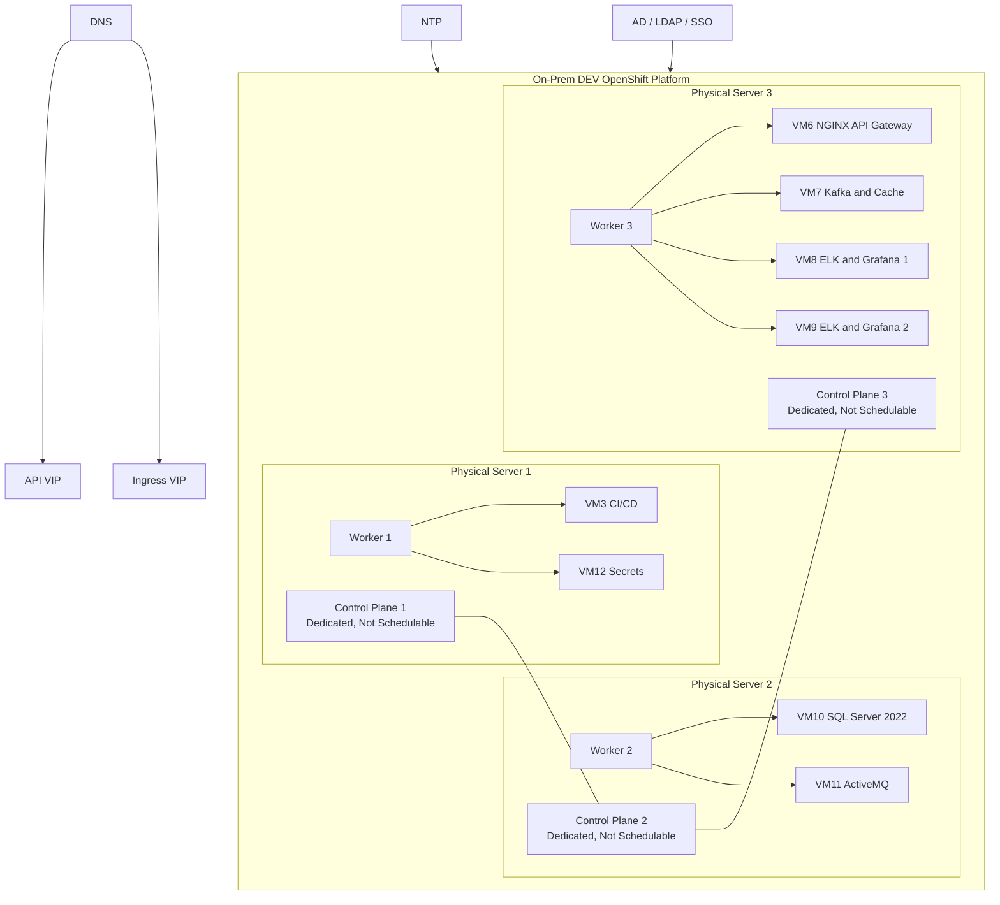
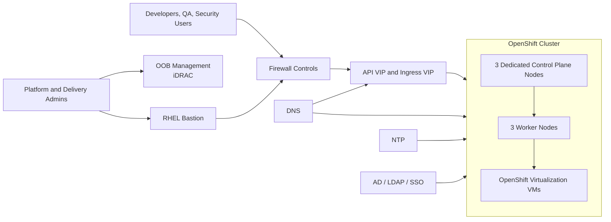

# OpenShift Virtualization DEV Execution Plan

## 0) Executive Summary

This execution plan defines the delivery sequence for a DEV environment built on three on-prem Dell EMC PowerEdge R750 servers, each hosting one dedicated OpenShift control plane node and one dedicated OpenShift worker node. All application workloads are to be provisioned as Red Hat OpenShift Virtualization virtual machines on worker nodes only. Control plane nodes remain unschedulable for workloads.

The plan is dependency-driven and suitable for client sign-off, delivery tracking, and audit review. Execution can proceed only when all prerequisite hardware, network, security, access, storage, and installation-method decisions are closed. Two gating items require explicit client decision before build execution: the method used to realize six OpenShift nodes on three physical servers under the no-unapproved-external-hypervisor rule, and the Worker-3 capacity gap between fixed VM placement and fixed worker CPU/local-disk sizing.

“Red Hat OpenShift Virtualization is a feature included with Red Hat OpenShift that enables organizations to run and manage traditional virtual machines (VMs) alongside containerized workloads on a single, unified Kubernetes platform.”

### 0.1 Target Build Topology

| Physical Server | Logical OpenShift Nodes on Server | Fixed Node Sizing | Fixed VM Placement |
|---|---|---|---|
| Server-1: Dell EMC PowerEdge R750 | Control Plane-1 and Worker-1 | CP-1: 8 vCPU, 64 GB RAM, 300 GB disk; Worker-1: 20 vCPU, 512 GB RAM, ~1.3 TB usable | Worker-1 hosts VM3 CI/CD and VM12 Secrets |
| Server-2: Dell EMC PowerEdge R750 | Control Plane-2 and Worker-2 | CP-2: 8 vCPU, 64 GB RAM, 300 GB disk; Worker-2: 20 vCPU, 512 GB RAM, ~1.3 TB usable | Worker-2 hosts VM10 SQL Server 2022 and VM11 ActiveMQ |
| Server-3: Dell EMC PowerEdge R750 | Control Plane-3 and Worker-3 | CP-3: 8 vCPU, 64 GB RAM, 300 GB disk; Worker-3: 20 vCPU, 512 GB RAM, ~1.3 TB usable | Worker-3 hosts VM6 NGINX, VM7 Kafka + Cache, VM8 ELK + Grafana, VM9 ELK + Grafana |

### 0.2 Logical Architecture

### 0.3 Network Topology

## 1) Pre-Execution Dependencies & Prerequisites

Execution is contingent upon the client providing all prerequisite hardware readiness, network services, storage layout confirmation, security integration inputs, access approvals, content-source decisions, and installation-method approvals before delivery execution starts. No phase may begin unless its entry criteria are satisfied and recorded.

### 1.1 Hardware Prerequisites

- Three Dell EMC PowerEdge R750 servers must be racked, powered, cabled, and inventoried with serial number, asset tag, MAC address, and iDRAC endpoint recorded.
- BIOS, iDRAC, RAID or HBA controller, NIC, and storage firmware must be updated to a client-approved and Red Hat-compatible baseline before cluster installation.
- UEFI boot must be enabled consistently across all three servers.
- Intel VT-x and VT-d must be enabled on all servers. Hyper-threading or SMT state must be configured consistently across the server set.
- Remote BMC or iDRAC access, virtual media, power-cycle control, and remote console access must be available to the platform delivery team.
- Hardware health must show no critical disk, memory, power, or thermal faults.
- The client must confirm the supported method by which one control plane node and one worker node will be realized per physical server without silently introducing an unapproved hypervisor dependency.

### 1.2 Network Prerequisites

- Client-approved VLANs, subnets, gateways, MTU, routing domains, and switch port configuration must be available for all OpenShift node networks and supporting services.
- API VIP and Ingress VIP addresses must be reserved before installation.
- If outbound proxying is required, the client must provide proxy URLs, `noProxy` values, and the approved egress allow-list for OpenShift, Operator, guest OS, and tool installation traffic.
- Required DNS records must be created before Phase 3, including `api`, `api-int`, and `*.apps` records for the selected cluster name and base domain.
- Forward and reverse DNS records must exist for every control plane node, worker node, bastion host, and any supporting infrastructure endpoint used during install.
- Enterprise NTP must be reachable from every node and from the bastion host.
- VIP health-check behavior, failover behavior, and monitoring method for the client-approved API VIP and Ingress VIP delivery mechanism must be defined before Phase 2 closes.
- Firewall paths must be approved for node-to-node traffic, bastion-to-cluster administration, outbound access to Red Hat content or the client-provided mirror, and workload-to-enterprise-service connectivity.
- AD, LDAP, or SSO endpoints intended for cluster authentication must be reachable from the cluster and validated by the security team.
- The client must define the supported method used to deliver API and Ingress VIP functionality on-premises. This plan does not assume a specific external appliance or software component.

### 1.3 Storage Prerequisites

- The only storage in scope is the local 2 TB SSD installed in each physical server.
- The client must confirm the server-local SSD presentation model, including RAID mode, HBA or JBOD mode, and the final layout used to satisfy one 300 GB control plane node and one worker node with approximately 1.3 TB usable disk per server.
- Disk layout must preserve sufficient overhead for the host installation process, filesystem operation, and node maintenance tasks.
- Local SSD space intended for VM disks must be reserved exclusively for OpenShift Virtualization storage and must not be consumed by unrelated host services.
- RWX shared storage is not in scope for this DEV execution unless separately provided by the client as an explicit addition.
- Worker-3 fixed VM placement requires 1,780 GB of VM disk allocation against a fixed worker usable-disk figure of approximately 1.3 TB; this is a blocking capacity dependency that must be resolved or formally accepted by the client before Phase 6 and Phase 7.

### 1.4 OS Prerequisites

- A client-approved Red Hat OpenShift version and matching Red Hat OpenShift Virtualization-supported release must be selected before Phase 3.
- A supported RHCOS-based installation workflow must be approved by the client for the six target OpenShift nodes.
- A bastion or jump host must be available for delivery execution. If the client does not already provide one, a RHEL 8 or RHEL 9 bastion host is required to host `oc`, `virtctl`, `openshift-install`, SSH keys, and installation artifacts.
- Red Hat pull secret, subscription entitlements, and any required registry access or mirrored content source must be available before installation begins.
- SSH public keys, bastion hardening baseline, endpoint protection requirements, and approved administrative tooling for the jump host must be provided before execution begins.
- If the environment is disconnected or proxied, the client must provide the approved mirror-registry design, image source list, and bastion-level proxy configuration before Phase 3.
- Guest operating system templates or installation media for each VM must be provided or approved by the client before VM provisioning.

### 1.5 Security Prerequisites

- TLS certificates, wildcard application certificate requirements, and the internal CA trust chain must be supplied or approved by the client.
- AD, LDAP, or SSO integration requirements, group mappings, and identity source endpoints must be approved by the security team.
- Break-glass admin accounts, service accounts, SSH key ownership, and credential custody processes must be defined before cluster handover.
- The target RBAC model for cluster administration, virtualization administration, application administration, and read-only audit access must be approved.
- Security scanning endpoints, proxy rules, license servers, and update paths required by Aqua, Checkmarx, SonarQube, and related tools must be reachable.
- Audit log forwarding targets, SIEM or syslog destinations, and log retention requirements for DEV must be defined.
- The enterprise security hardening baseline for RHCOS, the bastion host, Linux guest VMs, and any Windows guest VMs must be provided or formally waived.
- MFA, privileged access management, session-recording, and password-vaulting requirements for administrative access must be defined before privileged access is granted.
- Vulnerability-scanning scope, scan windows, remediation SLAs, and exception-management process for the cluster, bastion host, and guest VMs must be approved.
- Endpoint detection and response, anti-malware, or host-based security-agent requirements for guest VMs must be supplied with required exclusions for OpenShift and application tooling before Phase 8.
- Compliance classification for the DEV environment, evidence-retention period, log-retention period, and CMDB or asset-registration requirements must be defined by the client.
- Certificate renewal ownership, service-account rotation cadence, encryption standards, and DEV backup-encryption expectations must be defined before handover.
- The client must select either HashiCorp Vault or CyberArk for VM12 before Phase 8.

### 1.6 Access Prerequisites

- Named delivery resources must have approved access to iDRAC, switch administration teams, firewall teams, DNS teams, AD or LDAP teams, and the bastion host.
- SSH access method, console access method, and privileged escalation process for all guest operating systems must be approved.
- Change windows, maintenance windows, rollback authority, and client approvers must be named before infrastructure changes begin.
- Access to the target source control repository and any internal package repositories or license portals required during tool installation must be available.
- Named service accounts or integration accounts for identity, logging, monitoring, backup, and package-repository access must be created or explicitly declared out of scope before execution.
- VPN, jump-host allow-listing, MFA enforcement, and emergency-access approval paths for delivery resources must be approved before Phase 1 begins.

### 1.7 Hypervisor and Virtualization Confirmation

- OpenShift Virtualization is the default and preferred virtualization layer for all application VMs in this execution.
- No external hypervisor required for application VM execution.
- No VMware, ESXi, or Hyper-V is assumed anywhere in this plan.
- Execution dependency: the client must explicitly confirm the supported method used to instantiate six independent OpenShift nodes on three physical servers before OpenShift Virtualization is available. If the client elects to use any host-level virtualization layer to satisfy that prerequisite, it must be raised, justified, and approved as an exception before Phase 3.

### 1.8 Network and Access Prerequisite Checklist

| Item | Requirement | Owner | Required By |
|---|---|---|---|
| Cluster base domain | Client-approved cluster name and base domain for DEV | Client | Phase 2 |
| API DNS | `api.<cluster>.<baseDomain>` resolves to API VIP | Network | Phase 2 |
| Internal API DNS | `api-int.<cluster>.<baseDomain>` resolves internally to API VIP | Network | Phase 2 |
| Apps wildcard DNS | `*.apps.<cluster>.<baseDomain>` resolves to Ingress VIP | Network | Phase 2 |
| Node DNS | A and PTR records for 3 control plane nodes, 3 worker nodes, bastion host, and supporting endpoints | Network | Phase 2 |
| VIP allocation | One API VIP and one Ingress VIP reserved and routable | Network | Phase 2 |
| Proxy and `noProxy` | If required, approved proxy settings and allow-list for OpenShift, Operators, guest OS, and tool downloads | Network and Security | Phase 2 |
| Content source reachability | Red Hat registry access or approved internal mirror reachable from bastion and cluster networks | Client and Security | Phase 2 |
| Firewall readiness | North-south, east-west, admin, identity, NTP, DNS, registry, and tooling paths approved | Security and Network | Phase 2 |
| NTP | All nodes and bastion host can sync to approved NTP sources | Network | Phase 2 |
| AD/LDAP/SSO | Identity source reachable with approved bind or trust details | Security | Phase 4 |
| RBAC readiness | Admin groups, virtualization admins, app owners, and audit roles approved | Security and Client | Phase 4 |
| PAM and MFA | Privileged-access path for bastion, cluster, and guest VMs approved and operational | Security | Phase 4 |
| SIEM and retention | Audit-log destination and retention requirements approved | Security | Phase 4 |

## 2) Dependency & Ownership Matrix

| Dependency | Description | Owner (Client/Network/Security/Platform/DBA) | Due by Phase | Validation method |
|---|---|---|---|---|
| Hardware delivery complete | All three R750 servers installed, cabled, and healthy | Client | Phase 0 | Asset register and hardware health evidence |
| Firmware and BIOS baseline | BIOS, iDRAC, NIC, and storage firmware aligned | Platform | Phase 1 | Firmware report and BIOS export |
| BMC access | iDRAC addresses, credentials, and remote console validated | Client | Phase 1 | Successful remote login and power-cycle test |
| Six-node realization method | Supported method for 3 control plane and 3 worker nodes on 3 servers approved | Client and Platform | Phase 0 | Signed design decision record |
| OpenShift version selection | Client-approved OCP release and supported OpenShift Virtualization release | Client and Platform | Phase 0 | Version approval record |
| Content source | Internet egress or client mirror for OpenShift and Operators | Client and Security | Phase 2 | Registry reachability test |
| Proxy and `noProxy` values | Approved proxy configuration and allow-list for bastion, cluster, and guest workload installation traffic | Network and Security | Phase 2 | Bastion connectivity validation |
| VLANs and subnets | All network segments, routing, MTU, and gateway details provided | Network | Phase 2 | Approved network sheet |
| DNS records | Node, API, API-int, and apps wildcard records created | Network | Phase 2 | Forward and reverse lookup validation |
| VIP delivery method | API and Ingress VIP implementation approved | Network | Phase 2 | VIP design sign-off |
| Firewall approvals | Required cluster, admin, identity, NTP, registry, and VM service flows opened | Security and Network | Phase 2 | Firewall rule verification |
| NTP services | Approved time sources reachable | Network | Phase 2 | `chronyc` or equivalent validation |
| Bastion host | Admin host available with required tools and access | Platform | Phase 3 | Host readiness checklist |
| Certificates and CA | Cluster and application certificate requirements approved | Security | Phase 4 | Certificate inventory and trust validation |
| AD/LDAP/SSO details | Identity source, groups, and mapping rules approved | Security | Phase 4 | Authentication test plan |
| RBAC model | Admin, operator, app-owner, and audit roles approved | Security and Client | Phase 4 | RBAC matrix sign-off |
| Hardening baseline | Approved OS and platform hardening standard for bastion and guest VMs | Security and Platform | Phase 4 | Baseline control review |
| PAM and MFA controls | Privileged access, session recording, and break-glass workflow approved | Security | Phase 4 | PAM and MFA access test |
| Vulnerability and EDR onboarding | Vulnerability scanning, EDR or anti-malware deployment plan, and exception path approved | Security | Phase 4 | Security tooling readiness review |
| SIEM and evidence retention | Audit-log destination, log retention, and evidence-retention controls approved | Security | Phase 4 | SIEM onboarding confirmation |
| Local storage layout | Local SSD partitioning or presentation confirmed for CP, worker, and VM disk use | Platform | Phase 6 | Storage layout sign-off |
| Worker-3 capacity decision | CPU overcommit and local-disk shortfall disposition approved | Client and Platform | Phase 0 | Signed capacity exception or client decision |
| VM guest OS media | Templates or ISO media for all required VMs available | Client | Phase 7 | Media checksum and accessibility validation |
| SQL installation inputs | SQL 2022 edition, licensing, OS choice, and service accounts approved | Client and DBA | Phase 8 | DBA-approved install pack |
| Secrets platform decision | HashiCorp Vault or CyberArk selected for VM12 | Client and Security | Phase 8 | Signed product decision |
| Kafka cache definition | Cache technology to pair with Kafka on VM7 approved | Client | Phase 8 | Design note approval |
| ELK and Grafana topology details | VM8 and VM9 operating pattern approved for DEV | Client and Platform | Phase 8 | Approved service design note |
| Backup scope | DEV backup, export, and restore expectations defined | Client and Platform | Phase 9 | Backup scope document |

## 3) Phased Execution Plan

### Phase 0: Readiness and Validation

**Objective**

Confirm that the fixed architecture, dependencies, installation approach, and capacity constraints are understood, owned, and approved before any server configuration begins.

**Entry Criteria**

- Client kickoff completed.
- Dependency owners nominated.
- Fixed architecture and VM placement acknowledged by client stakeholders.

**Step-by-Step Tasks**

1. Review the fixed physical server profile, node sizing, and VM placement with platform, network, security, and client owners.
2. Validate the required logical topology of three control plane nodes and three worker nodes across the three physical servers.
3. Validate worker-level capacity math against fixed VM placement.
4. Record the Worker-3 CPU and disk shortfall as a blocking dependency.
5. Record the required client decision for the supported method used to realize six OpenShift nodes on three physical servers.
6. Confirm target OpenShift version, content source model, and VIP delivery method are assigned to owners.
7. Freeze the prerequisite tracker, phase gates, change windows, and sign-off path.

**Outputs**

- Signed readiness assessment.
- Dependency tracker with owners and due dates.
- Decision log for unresolved client items.
- Approved implementation calendar.

**Validation Commands/Tests with Expected Results**

| Validation Command/Test | Expected Result |
|---|---|
| Prerequisite tracker review against signed checklist | All blocking prerequisites are assigned owners and due phases |
| Capacity workbook review of fixed VM totals versus worker sizing | Worker-1 and Worker-2 fit fixed sizing, and the Worker-3 shortfall is documented with approved disposition |
| Decision log review | Six-node realization method, OpenShift version, and VIP delivery method are recorded as approved or assigned for closure |
| Kickoff sign-off review | Client, network, security, platform, and DBA stakeholders are recorded as participants in readiness approval |

**Exit Criteria**

- All blocking prerequisites are assigned.
- Worker-3 capacity decision is closed or formally accepted.
- Six-node realization method is approved.

**Rollback/Exit Plan**

- If any blocking item remains open, stop execution before infrastructure changes.
- Issue a readiness exception report and reschedule after client decisions are closed.

### Phase 1: Bare Metal and Firmware/BIOS Preparation

**Objective**

Prepare all three physical servers to a common, supportable baseline for OpenShift installation.

**Entry Criteria**

- Phase 0 exit criteria met.
- Maintenance window approved.
- iDRAC access and firmware packages available.

**Step-by-Step Tasks**

1. Validate hardware health and capture current firmware and BIOS levels.
2. Apply approved BIOS, iDRAC, NIC, and storage-controller firmware updates.
3. Set consistent UEFI boot configuration across all servers.
4. Enable Intel VT-x and VT-d on all servers.
5. Apply the client-approved local SSD presentation model and record the resulting disk layout.
6. Validate remote console, virtual media, and power control for each server.
7. Record final MAC addresses, NIC mappings, and storage presentation details for install use.

**Outputs**

- Firmware baseline report.
- BIOS configuration evidence.
- Hardware health evidence.
- Final asset and interface inventory.

**Validation Commands/Tests with Expected Results**

| Validation Command/Test | Expected Result |
|---|---|
| iDRAC hardware inventory export and health review | All three servers report healthy status and matching hardware profile |
| BIOS settings review for UEFI, VT-x, and VT-d | Virtualization flags and boot mode are enabled consistently on all servers |
| Firmware inventory comparison against approved baseline | BIOS, iDRAC, NIC, and storage-controller firmware match the approved version set |
| Remote console and power-cycle test from iDRAC | Each server can be remotely mounted, rebooted, and observed successfully |

**Exit Criteria**

- All three servers are on the same approved baseline.
- Delivery team can manage each server remotely.

**Rollback/Exit Plan**

- If firmware or BIOS changes introduce instability, revert to the previous approved baseline and halt before OS installation.

### Phase 2: Network, DNS, and NTP Readiness

**Objective**

Establish all required name resolution, VIP, timing, route, and firewall dependencies before OpenShift installation.

**Entry Criteria**

- Phase 1 completed.
- Network design inputs approved.
- Firewall change process active.

**Step-by-Step Tasks**

1. Reserve IP addresses for all control plane nodes, worker nodes, bastion host, API VIP, and Ingress VIP.
2. Create forward and reverse DNS records for nodes and cluster endpoints.
3. Implement the client-approved API VIP and Ingress VIP delivery method.
4. Validate L3 routing from bastion, nodes, and supporting services.
5. Open and verify required firewall paths for install, administration, identity, content source, and application service flows.
6. Validate enterprise NTP reachability and time synchronization from the bastion host and representative node networks.
7. Validate identity-source reachability if AD, LDAP, or SSO will be integrated post-install.

**Outputs**

- Network readiness sheet.
- DNS and VIP evidence.
- Firewall approval record.
- NTP validation evidence.

**Validation Commands/Tests with Expected Results**

| Validation Command/Test | Expected Result |
|---|---|
| `nslookup api.<cluster>.<baseDomain>` and `nslookup api-int.<cluster>.<baseDomain>` from bastion | Both names resolve to the approved API VIP |
| `nslookup test.apps.<cluster>.<baseDomain>` from bastion | Test wildcard application name resolves to the approved Ingress VIP |
| `chronyc sources -v` from bastion | Approved NTP sources are reachable and selected |
| `nc -vz <mirror-or-registry-endpoint> 443` and `nc -vz <idp-endpoint> 443` from bastion | Required outbound HTTPS paths are open |
| Firewall rule test matrix executed by network and security teams | Approved ports and routes succeed between required endpoints |

**Exit Criteria**

- All cluster DNS and VIP records exist.
- Firewall and NTP dependencies are confirmed.

**Rollback/Exit Plan**

- Revert unapproved network changes and pause execution if DNS, VIP, or firewall gaps remain.

### Phase 3: OpenShift Installation (3 Control Plane and 3 Worker Nodes)

**Objective**

Install a six-node OpenShift cluster consisting of three dedicated control plane nodes and three dedicated worker nodes.

**Entry Criteria**

- Phase 2 completed.
- Client-approved OpenShift version selected.
- Pull secret and content source available.
- Six-node realization method approved.

**Step-by-Step Tasks**

1. Prepare the bastion host with the approved OpenShift installation binaries and access credentials.
2. Create the installation configuration using the approved cluster name, base domain, and networking inputs.
3. Define the six node identities: three dedicated control plane nodes and three dedicated worker nodes.
4. Execute the client-approved Red Hat-supported installation workflow for the six-node layout.
5. Confirm the cluster scheduler is configured with `mastersSchedulable=false` so control plane nodes remain dedicated and not schedulable for user workloads.
6. Confirm control plane nodes retain the expected `NoSchedule` taints and that no user workloads or VMs can land on them.
7. Confirm all cluster operators reach stable state.
8. Establish baseline administrative access from the bastion host.

**Outputs**

- Running OpenShift cluster.
- Bastion administration access.
- Initial cluster configuration backup.
- Evidence that control plane nodes are dedicated and not schedulable.

**Validation Commands/Tests with Expected Results**

| Validation Command/Test | Expected Result |
|---|---|
| `oc get nodes` | Exactly 3 control plane nodes and 3 worker nodes show `Ready` state |
| `oc get schedulers.config.openshift.io cluster -o jsonpath='{.spec.mastersSchedulable}'` | Returns `false` |
| `oc get nodes -l node-role.kubernetes.io/master -o custom-columns=NAME:.metadata.name,UNSCHEDULABLE:.spec.unschedulable` | All control plane nodes show dedicated unschedulable state |
| `oc describe node <control-plane-node> | grep -i Taints` | Each control plane node includes a `NoSchedule` taint and is not available for VM or user workload placement |
| `oc get co` | Core cluster operators report `Available=True` and no blocking degraded state |
| Bastion-to-API login test using `oc login` | Cluster API reachable from the approved admin network |

**Exit Criteria**

- Six-node cluster is stable.
- Admin access works from the bastion host.
- Control plane nodes are confirmed dedicated and not schedulable for user workloads or VMs.

**Rollback/Exit Plan**

- If installation fails or cluster health is unstable, destroy the partial deployment using the approved method, preserve logs, and restart only after blocker resolution.

### Phase 4: Post-Install Baseline Hardening, RBAC, and Monitoring Baseline

**Objective**

Apply the minimum operational and security baseline required before enabling virtualization and onboarding VMs.

**Entry Criteria**

- Phase 3 completed.
- Cluster health stable.
- Security and identity inputs approved.

**Step-by-Step Tasks**

1. Configure the approved identity provider integration for AD, LDAP, or SSO.
2. Implement the approved RBAC model for cluster administrators, virtualization administrators, application owners, and auditors.
3. Configure cluster certificates and trust chain as required for DEV.
4. Enable audit logging, log forwarding, and baseline monitoring integration per client policy.
5. Validate break-glass admin procedure and privileged access custody.
6. Record the post-install baseline and export relevant configuration evidence.

**Outputs**

- Cluster hardening record.
- Approved RBAC implementation.
- Identity integration evidence.
- Monitoring and audit baseline evidence.

**Validation Commands/Tests with Expected Results**

| Validation Command/Test | Expected Result |
|---|---|
| Browser or CLI SSO login test using an approved test identity | Approved identity users authenticate successfully |
| `oc auth can-i` or `oc adm policy who-can` tests executed with approved test roles | Only approved groups hold elevated permissions |
| `openssl s_client -connect <api-or-app-endpoint>:443 -showcerts` | Certificate chain matches the approved CA and is within validity period |
| Audit-log forwarding test to approved SIEM or syslog destination | Audit events are generated and visible at the target destination |
| `oc get co monitoring` and alerting baseline review | Cluster monitoring components are healthy and baseline alerts are present |

**Exit Criteria**

- Identity, RBAC, and audit baseline are operational.
- Cluster meets the agreed DEV hardening baseline.

**Rollback/Exit Plan**

- Remove unapproved identity provider settings, restore break-glass access, and revert recent policy changes if access or audit functions fail.

### Phase 5: OpenShift Virtualization Enablement (Operator and HyperConverged CR)

**Objective**

Enable Red Hat OpenShift Virtualization on the worker nodes so that all application workloads can run as VMs on the OpenShift platform.

**Entry Criteria**

- Phase 4 completed.
- Cluster operators healthy.
- Worker nodes available for virtualization workloads.

**Step-by-Step Tasks**

1. Install the Red Hat OpenShift Virtualization Operator from the approved catalog source.
2. Create and validate the HyperConverged custom resource.
3. Confirm KubeVirt and supporting components are running successfully on worker nodes.
4. Define virtualization namespaces, role bindings, and administration boundaries.
5. Confirm VM workloads cannot schedule to control plane nodes.
6. Validate `virtctl` access and test a minimal VM lifecycle operation.

**Outputs**

- OpenShift Virtualization enabled cluster.
- HyperConverged configuration.
- Virtualization administration model.

**Validation Commands/Tests with Expected Results**

| Validation Command/Test | Expected Result |
|---|---|
| `oc get csv -A | grep -i kubevirt` | OpenShift Virtualization Operator installation succeeded |
| `oc get hyperconverged -A` | HyperConverged custom resource reports healthy status |
| `oc get pods -A -o wide | grep -E 'virt-|kubevirt'` | Virtualization pods run only on worker nodes |
| `virtctl start <smoke-vm>` followed by `oc get vmi -A -o wide` | Smoke VM enters `Running` state on a worker node and stops cleanly when requested |

**Exit Criteria**

- OpenShift Virtualization is healthy and ready for storage configuration.

**Rollback/Exit Plan**

- If virtualization enablement fails before VM onboarding, remove the operator and related resources, collect logs, and return the cluster to the Phase 4 baseline.

### Phase 6: VM Storage Setup (Local SSD Strategy) and Limitation Statement

**Objective**

Implement the DEV-local storage approach for VM disks using only the local SSD capacity available on each worker node.

**Entry Criteria**

- Phase 5 completed.
- Local SSD layout approved.
- Worker-3 capacity decision closed.

**Step-by-Step Tasks**

1. Reserve worker-local disk capacity for OpenShift Virtualization VM disks in accordance with the approved local SSD layout.
2. Configure the DEV storage method for node-local VM disks using worker-local storage classes and persistent volumes aligned to worker placement.
3. Define storage classes, reclaim policy, naming standard, and quota controls for VM disks.
4. Document that VM disks are node-local and that shared RWX storage is not present in this scope.
5. Validate image import and test disk provisioning for a sample VM.
6. Record per-worker usable capacity and planned allocations for audit.

**Outputs**

- Local VM storage configuration.
- Capacity ledger per worker.
- Storage limitation statement.

**Validation Commands/Tests with Expected Results**

| Validation Command/Test | Expected Result |
|---|---|
| `oc get storageclass` | Approved worker-local storage classes are present |
| `oc get pv,pvc -A | grep <local-storage-class>` | Test PV and PVC objects are created successfully |
| `oc describe pvc <test-pvc>` | PVC binds to the intended local storage on the expected worker |
| Capacity review using `oc get pv -A` and the worker allocation ledger | Per-worker allocated disk aligns to the approved placement plan and accepted exception record |
| Storage limitation acknowledgment review | Live-migration limitation for local-only DEV storage is documented and accepted |

**Exit Criteria**

- VM disk storage is available on each worker.
- Storage limitations are formally accepted for DEV.

**Rollback/Exit Plan**

- Delete unused storage resources, reclaim unconsumed local capacity, and stop before application VM provisioning if storage validation fails.

### Phase 7: VM Provisioning and Strict Placement Mapping

**Objective**

Provision the fixed set of application VMs on the designated worker nodes with the approved sizes and node placement rules.

**Entry Criteria**

- Phase 6 completed.
- Guest OS media available.
- Worker-3 capacity decision approved.

**Step-by-Step Tasks**

1. Create VM definitions with the fixed vCPU, memory, and disk values.
2. Apply node affinity or equivalent placement controls so each VM runs only on its designated worker.
3. Provision VM disks from the worker-local storage configuration.
4. Build or import the operating systems for each VM.
5. For VM11 ActiveMQ, import the existing service data and configuration according to the approved migration method.
6. Install guest agents, time synchronization, and base operating system hardening controls.
7. Record final VM inventory, node placement, IP addressing, and access ownership.

**Strict Placement Map**

| Worker | Assigned VMs | Aggregate vCPU | Aggregate RAM | Aggregate Disk | Fixed Worker Capacity Observation |
|---|---|---|---|---|---|
| Worker-1 | VM3, VM12 | 20 | 112 GB | 750 GB | Fits fixed worker CPU and disk figures |
| Worker-2 | VM10, VM11 | 20 | 144 GB | 1,000 GB | Fits fixed worker CPU and disk figures |
| Worker-3 | VM6, VM7, VM8, VM9 | 28 | 208 GB | 1,780 GB | Exceeds fixed worker CPU by 8 vCPU and fixed usable disk by approximately 480 GB |

**Outputs**

- Provisioned VM inventory.
- Placement policy evidence.
- Base operating system build records.

**Validation Commands/Tests with Expected Results**

| Validation Command/Test | Expected Result |
|---|---|
| `oc get vm,vmi -A -o wide` | All fixed-scope VMs are present and running VMs show the intended worker placement |
| `oc get vmi -A -o custom-columns=VM:.metadata.name,NODE:.status.nodeName` | Each VM runs only on its designated worker node |
| Guest console or `ssh` login test to each VM | Each VM boots successfully and guest OS access works |
| `oc describe vm <vm-name>` placement-control review | Node affinity or equivalent placement control is present for each VM |
| Capacity validation against the fixed placement table and approved exception log | Worker-3 provisioning proceeds only under the approved client decision covering CPU and disk gaps |

**Exit Criteria**

- All fixed-scope VMs are provisioned.
- Placement mapping is enforced.
- Capacity exception evidence is attached for Worker-3 if required.

**Rollback/Exit Plan**

- Remove failed or non-compliant VMs, reclaim their local storage, and rebuild from approved templates after issue correction.

### Phase 8: Tool Installation and Configuration Inside Each VM

**Objective**

Install and configure the required application stack components inside the provisioned VMs.

**Entry Criteria**

- Phase 7 completed.
- VM operating systems are available.
- Product decisions, licenses, media, and service accounts are approved.

**Step-by-Step Tasks**

1. Harden each guest operating system, apply required patch levels, and configure time sync, DNS, and approved access controls.
2. Configure VM3 with Jenkins, Nexus, SonarQube, Aqua, Checkmarx, Redgate, Maven, JDK, Newman, and NodeJS.
3. Configure VM12 with the client-selected secrets platform, either HashiCorp Vault or CyberArk.
4. Configure VM10 with Microsoft SQL Server 2022 using the client-approved edition, operating system, service accounts, and storage layout.
5. Restore or reconfigure VM11 ActiveMQ using the approved existing-instance migration procedure.
6. Configure VM6 with F5 NGINX API Gateway and import or create the required gateway policies and certificates.
7. Configure VM7 with Kafka and the client-specified cache component.
8. Configure VM8 and VM9 with the client-approved ELK and Grafana DEV topology and ingest paths.
9. Integrate VM3 with VM12 so CI/CD jobs obtain secrets through the approved secrets-management pattern.
10. Configure tool-level logging, backups or exports as defined for DEV, and role-based access controls.

**Outputs**

- Configured application VMs.
- Tool access records.
- Secrets integration evidence.
- Service configuration baseline.

**Validation Commands/Tests with Expected Results**

| Validation Command/Test | Expected Result |
|---|---|
| `systemctl status` checks for Jenkins, Nexus, and SonarQube on VM3 | Core CI/CD services are active |
| CI/CD smoke pipeline run | Jenkins executes a pipeline using the approved toolchain successfully |
| Secrets retrieval test from Jenkins to VM12 using the approved plugin or API | CI/CD stack retrieves secrets successfully without cleartext credential storage |
| `sqlcmd -S <sql-host> -Q "SELECT @@VERSION"` | SQL Server 2022 responds successfully |
| Queue or topic smoke test for ActiveMQ and Kafka | Test message send and receive operations succeed |
| `curl -sk https://<nginx-host>/health` | API gateway returns the expected healthy response |
| `curl -s http://<elasticsearch-host>:9200/_cluster/health` and `curl -sk https://<grafana-host>/api/health` | ELK and Grafana endpoints respond with healthy status acceptable for DEV |

**Exit Criteria**

- All required tools are installed and reachable.
- Secrets, logging, and access controls are functional.
- Tool-level smoke tests pass.

**Rollback/Exit Plan**

- Revert failed service configuration where possible or rebuild the affected VM from the approved baseline image and reapply validated configuration.

### Phase 9: End-to-End Validation and Handover

**Objective**

Validate the integrated DEV platform, complete handover artifacts, and obtain client acceptance.

**Entry Criteria**

- Phase 8 completed.
- All component smoke tests passed.
- Client stakeholders available for sign-off.

**Step-by-Step Tasks**

1. Execute platform health checks across the OpenShift cluster and all application VMs.
2. Validate cluster access, identity integration, RBAC, audit logging, and monitoring visibility.
3. Execute end-to-end application-path tests spanning CI/CD, secrets, SQL, messaging, API gateway, Kafka, and observability.
4. Validate the DEV backup or export approach that is in scope.
5. Deliver final diagrams, runbooks, access lists, credential custody records, and support model details.
6. Conduct operational handover and review known limitations, risks, and support boundaries.
7. Obtain formal client sign-off or record residual open issues.

**Outputs**

- End-to-end validation report.
- Handover pack.
- Signed acceptance record or exception log.

**Validation Commands/Tests with Expected Results**

| Validation Command/Test | Expected Result |
|---|---|
| `oc get nodes,co` | Cluster nodes and critical operators remain healthy |
| `oc get vmi -A -o custom-columns=VM:.metadata.name,NODE:.status.nodeName` | VMs remain on the approved worker nodes |
| End-to-end delivery smoke run through CI/CD, secrets, messaging, database, gateway, and observability paths | Test transactions succeed across the required platform components |
| Audit-log, SIEM, and monitoring review | Logs, alerts, and access events are visible as designed |
| Backup, export, or rebuild drill for the approved DEV recovery method | The selected DEV recovery method completes successfully |
| Formal handover checklist walkthrough | Client confirms receipt of required artifacts, support contacts, and accepted limitations |

**Exit Criteria**

- Client sign-off received, or residual risks are documented with owner and due date.
- Handover pack accepted.

**Rollback/Exit Plan**

- Hold go-live, retain DEV environment for remediation, and track failed validation items through a formal defect and exception process.

## 4) Storage & Availability Note

- This DEV plan uses only the local 2 TB SSD installed in each physical server for control plane nodes, worker nodes, and VM disks.
- VM disks are planned as worker-local storage allocations. This is appropriate for DEV when node-local persistence and rebuild-based recovery are acceptable.
- Because RWX shared storage is not part of this scope, live migration of VMs is limited or out of scope. VM disks are not shared across workers in this plan.
- If a worker node fails, VMs using only that worker's local storage are not expected to live-migrate automatically to another worker. Recovery depends on node restoration, VM rebuild, or the DEV backup or export approach approved by the client.
- For DEV, this limitation can be acceptable if the client accepts reduced mobility and recovery expectations.
- For PROD, the storage design would need shared, resilient RWX-capable storage, stronger recovery controls, and capacity headroom sufficient for maintenance and failover activities.

## 5) Security Baseline Checklist (DevSecOps)

### 5.1 RBAC and SSO Integration Points

- [ ] Cluster identity source approved and integrated with AD, LDAP, or SSO.
- [ ] Cluster-admin, virtualization-admin, application-admin, read-only, and audit roles are mapped to approved groups.
- [ ] Break-glass access procedure documented and stored under client custody.

### 5.2 TLS Requirements

- [ ] Cluster ingress and API certificate requirements approved.
- [ ] Internal CA chain imported where required.
- [ ] Tool endpoints on VMs use approved TLS certificates and ciphers per client policy.

### 5.3 Secrets Handling

- [ ] VM12 product decision made: HashiCorp Vault or CyberArk.
- [ ] Jenkins and associated CI/CD jobs retrieve secrets from the approved secrets platform rather than storing cleartext credentials locally.
- [ ] Service account ownership, rotation, and revocation process documented.

### 5.4 Scanning Gates

- [ ] SonarQube quality gates defined for DEV pipelines.
- [ ] Checkmarx scanning access and policy baseline configured.
- [ ] Aqua runtime or image-scanning integration configured as approved.
- [ ] Nexus repository and artifact governance controls align with client policy.

### 5.5 Audit Logging and Access Logging

- [ ] OpenShift audit logging enabled and forwarded to the client-approved destination.
- [ ] Administrative access to bastion, cluster, and VMs is logged.
- [ ] API gateway, CI/CD, messaging, database, and observability access logs are retained per DEV policy.

## 6) Go-Live Readiness Checklist

### 6.1 Platform Health Checks

- [ ] Three control plane nodes are Ready and unschedulable.
- [ ] Three worker nodes are Ready and host only the intended VM workloads.
- [ ] OpenShift Virtualization components are healthy.
- [ ] API VIP and Ingress VIP are reachable from approved client networks.

### 6.2 Security Sign-Offs

- [ ] Identity integration validated.
- [ ] RBAC sign-off completed.
- [ ] TLS certificates deployed and validated.
- [ ] Audit logging and access logging confirmed.
- [ ] Secrets integration from CI/CD to Vault or CyberArk validated.

### 6.3 Operational Readiness

- [ ] Named support owners and escalation paths agreed.
- [ ] Bastion access, privileged access, and change control process handed over.
- [ ] Standard operating procedures for VM restart, cluster access, and local-storage limitations documented.
- [ ] Known limitations for DEV, including local-storage mobility constraints, reviewed with client stakeholders.

### 6.4 Monitoring and Logging Readiness

- [ ] Cluster monitoring baseline healthy.
- [ ] ELK and Grafana ingest required logs and metrics.
- [ ] Critical alerts and dashboard ownership assigned.

### 6.5 Backup and Restore Readiness (DEV Scope)

- [ ] Client-approved DEV backup, export, or rebuild strategy documented.
- [ ] Recovery expectations for node-local VM disks reviewed and accepted.
- [ ] Configuration exports and credential custody process completed.

### 6.6 Handover Artifacts List

- [ ] Final execution plan.
- [ ] Final logical architecture and network topology diagrams.
- [ ] Build inventory of servers, nodes, VMs, IPs, and DNS records.
- [ ] RBAC matrix and access ownership record.
- [ ] Operational runbooks and support contacts.
- [ ] Backup or export policy for DEV.
- [ ] Defect list, risk register, and accepted exceptions.

## 7) Risks, Assumptions, Decisions Required from Client

### 7.1 Risks

- The fixed requirement to run six OpenShift nodes on three physical servers cannot be executed until the client confirms the supported implementation method for that layout.
- Worker-3 fixed placement exceeds the stated worker capacity by 8 vCPU and approximately 480 GB of usable local disk, creating a direct delivery risk if not resolved before provisioning.
- Local-only SSD storage limits VM mobility and increases recovery dependency on rebuild, restore, or node repair.
- Combined tooling on VM3 can create operational contention in DEV if pipeline usage, scanning jobs, and artifact activity overlap.
- VM12 is a single DEV secrets VM; no application-level HA requirement has been provided in scope.
- VM11 is an existing ActiveMQ workload and may carry undocumented configuration or migration dependencies.

### 7.2 Assumptions

No unresolved planning assumptions are retained in this plan. Items that require client confirmation or approval have been moved to **Decisions Required from Client**.

### 7.3 Decisions Required from Client

- Select the target OpenShift version and confirm the matching OpenShift Virtualization-supported release.
- Confirm the supported method used to instantiate one control plane node and one worker node per physical server.
- Approve the disposition for the Worker-3 CPU and disk shortfall against the fixed placement and fixed worker size.
- Confirm the on-prem API VIP and Ingress VIP delivery method.
- Confirm proxy, `noProxy`, and outbound allow-list requirements for the bastion host, cluster, Operators, guest OS patching, and tool installation paths.
- Confirm whether the environment is connected to Red Hat registries or requires a client-provided mirror.
- Confirm that all required network, identity, firewall, certificate, logging, monitoring, and content-source dependencies will be delivered before the relevant phase gates.
- Confirm that DEV acceptance criteria allow local-only VM storage without RWX-backed live migration.
- Confirm the approved security-hardening baseline, vulnerability-management process, EDR or anti-malware requirements, and SIEM onboarding expectations for the environment.
- Confirm the approved privileged-access model, including MFA, PAM, session recording, and break-glass workflow.
- Confirm that the client will provide the required licenses, binaries, install media, templates, and subscriptions for the application stack before Phase 7 and Phase 8.
- Select HashiCorp Vault or CyberArk for VM12.
- Define the cache technology paired with Kafka on VM7.
- Define the intended ELK and Grafana operating pattern across VM8 and VM9 for DEV.
- Provide the base domain, cluster name, VLANs, subnets, gateways, DNS records, and NTP sources.
- Provide certificate requirements, CA chain, and identity integration details.
- Define guest operating system standards and install media for each VM, including the operating system for SQL Server 2022.
- Confirm SQL Server 2022 edition, licensing model, service accounts, and backup expectations.
- Confirm DEV backup, export, and restore expectations for node-local VM disks and application configurations.