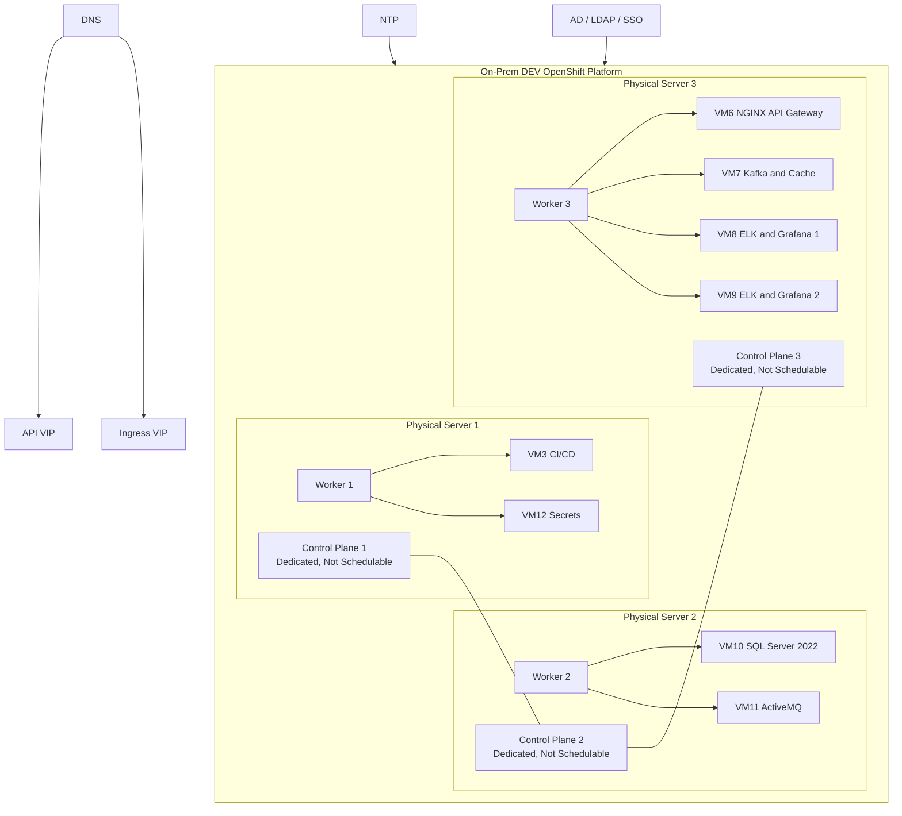
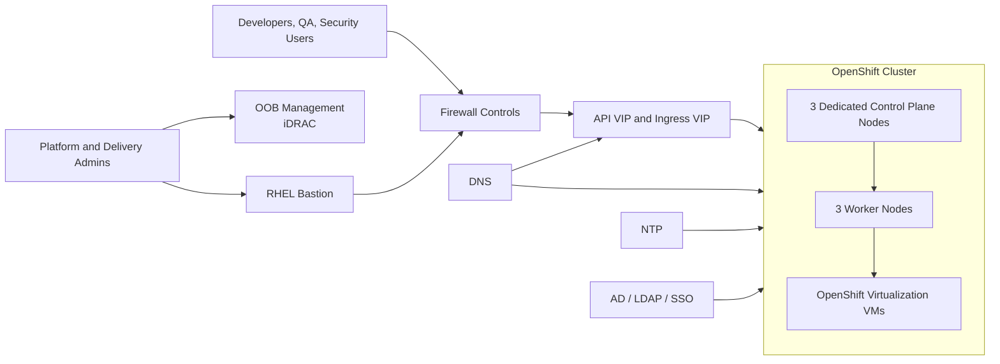

### FILE: execution-plan/execution-plan/01-architecture-baseline.md

# 01 Architecture Baseline

## Physical Infrastructure (Fixed)

- Three identical Dell EMC PowerEdge R750 servers.
- CPU per server: 2 × Intel Xeon Silver 4310, 24 physical cores (48 threads).
- RAM per server: 64 × 32 GB RDIMM = 2 TB.
- Local storage per server: 2 TB SSD. No shared storage in DEV scope.

## Cluster Topology (Fixed)

- 3 dedicated Control Plane nodes.
- 3 dedicated Worker nodes.
- Each physical server hosts one control plane node and one worker node.
- Control plane nodes are not schedulable for user workloads or VMs.

## Node Sizing (Fixed)

| Role | vCPU | RAM | Disk |
|---|---|---|---|
| Control Plane (each) | 8 | 64 GB | 300 GB |
| Worker (each) | 20 | 512 GB | ~1.3 TB usable |

## Application VM Placement (Fixed)

| Worker | VM | Purpose | vCPU | RAM | Disk |
|---|---|---|---|---|---|
| Worker-1 | VM3 | CI/CD Stack: Jenkins, Nexus, SonarQube, Aqua, Checkmarx, Redgate, Maven, JDK, Newman, NodeJS | 16 | 96 GB | 600 GB |
| Worker-1 | VM12 | Secrets: HashiCorp Vault OR CyberArk | 4 | 16 GB | 150 GB |
| Worker-2 | VM10 | MS SQL Server 2022 | 16 | 128 GB | 800 GB |
| Worker-2 | VM11 | ActiveMQ (existing) | 4 | 16 GB | 200 GB |
| Worker-3 | VM6 | F5 NGINX API Gateway | 4 | 16 GB | 80 GB |
| Worker-3 | VM7 | Kafka + Cache | 8 | 64 GB | 500 GB |
| Worker-3 | VM8 | ELK + Grafana (Instance 1) | 8 | 64 GB | 600 GB |
| Worker-3 | VM9 | ELK + Grafana (Instance 2) | 8 | 64 GB | 600 GB |

### Worker Aggregate Observation

| Worker | Aggregate vCPU | Aggregate RAM | Aggregate Disk | Fixed Worker Capacity Observation |
|---|---|---|---|---|
| Worker-1 | 20 | 112 GB | 750 GB | Fits fixed worker CPU and disk |
| Worker-2 | 20 | 144 GB | 1,000 GB | Fits fixed worker CPU and disk |
| Worker-3 | 28 | 208 GB | 1,780 GB | Exceeds fixed worker CPU by 8 vCPU and fixed usable disk by approximately 480 GB — requires client disposition |

## Logical Architecture

## Network Topology

## Hypervisor Confirmation

- OpenShift Virtualization is the default and preferred virtualization layer for all application VMs.
- No external hypervisor required for application VM execution.
- No VMware, ESXi, or Hyper-V is assumed anywhere in this plan.
